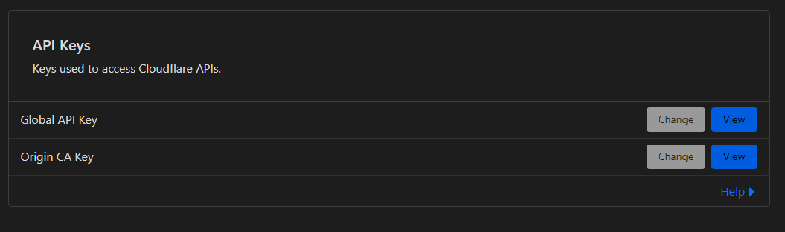

# Pythonic V2ray Assistant

This project aims to assist you with automating the process of managing V2ray Configs 
(***Vmess/Vless***) by changing **Address** field of your configs and changing a 
cloudflare DNS Record by using cloudflare api.

## Requirements

* API Key
* Email Address
* Zone ID

### API key
To use this project as it was meant to be you should first visit [Cloudflare API Page](https://dash.cloudflare.com/profile/api-tokens)
and copy your ***Global API Key*** from the section specified for it.

### Email Address
Nothing special, just the email address that is used as the username of your cloudflare account

### Zone ID
The next step is to find the Zone ID of the domain you want to update. You can find the Zone ID by 
following the instructions provided in the Cloudflare documentation: [Cloudflare Documentation]( https://developers.cloudflare.com/fundamentals/get-started/basic-tasks/find-account-and-zone-ids/)

1. Click on the domain you want to manage.
2. In the left-hand sidebar, click on “Overview.”
3. Scroll to the “API” section and click “Get your API key.”
4. Click on the “View” button next to the Global API Key.
5. Copy the key and keep it somewhere safe.

## Changing the Data you entered
### Json Files
Any Data asked by the program and entered by you is saved to 
> CurrentWorkingDirectory/Paths.json

> CurrentWorkingDirectory/Credentials.json

### _Paths.json_ 
Contains the Paths you enter such as the path where **_the file containing IP addresses_** is located at.

### _Credentials.json_
Contains the data such as your **_api key_, _Email Address_ and _ZoneID_** in which you entered.

You can access these files and edit them, or you can just use the option in the app.

# Bug fixes and PR

**Any Issues and Bug fix requests is welcomed and thanked :) 
I'll be glad to improve this project, it was just a hobby anyways :)**